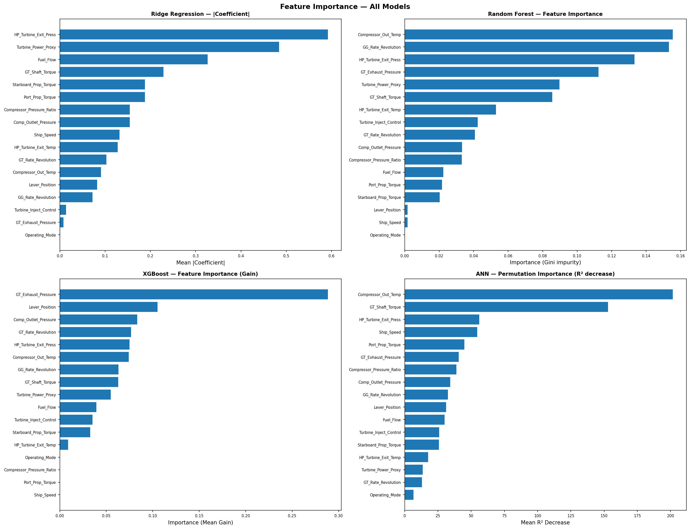
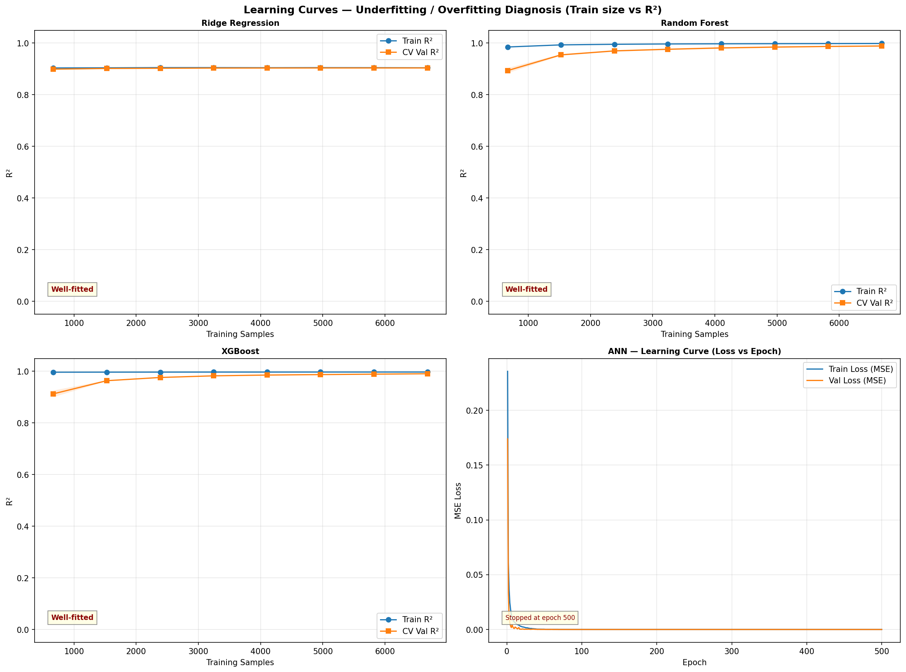
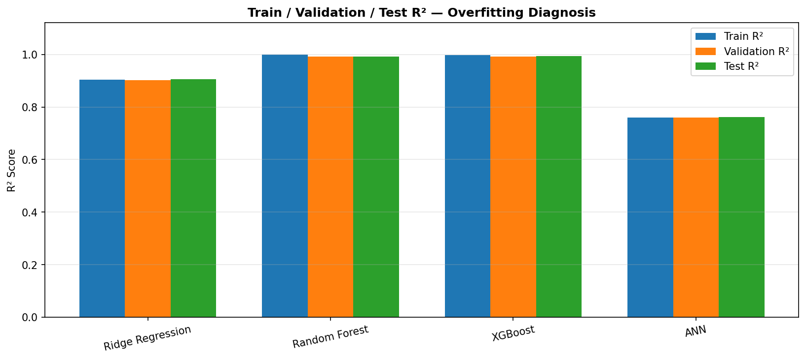
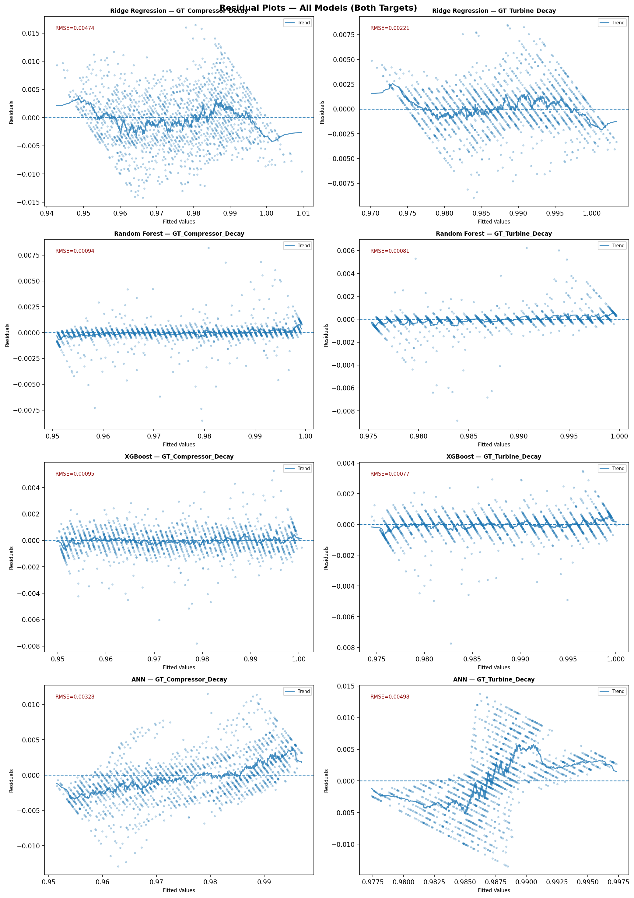
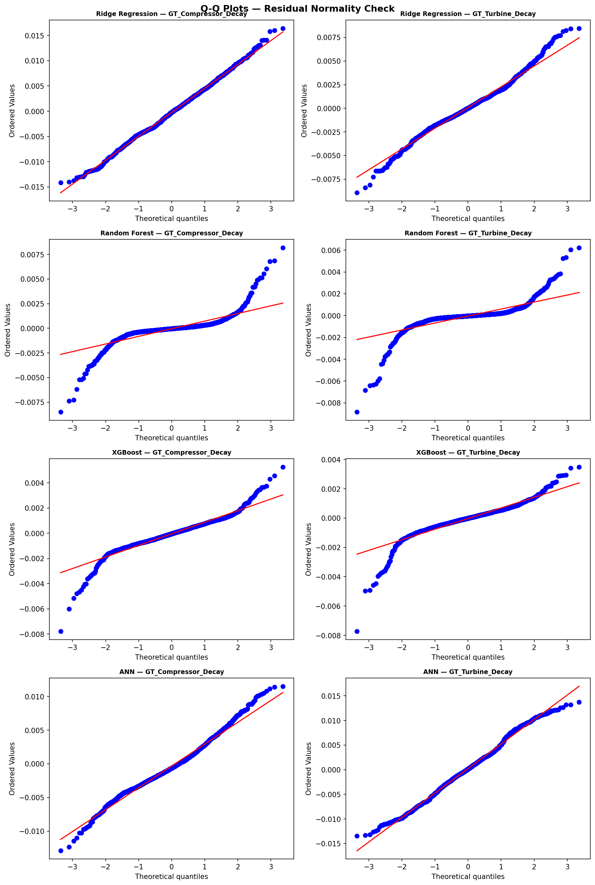

<h1 align="center">Naval Propulsion Predictive Maintenance</h1>

<p align="center">
Machine Learning system for predicting gas turbine degradation using XGBoost (R² = 0.9928)
</p>

<p align="center">


</p>

---

## 🚀 Overview

This project develops an end-to-end **Condition-Based Maintenance (CBM)** system for naval gas turbine propulsion systems.

It predicts:
- Compressor Decay
- Turbine Decay

using 16 real-time sensor inputs from a CODLAG propulsion plant.

> 🏆 **Best Model:** XGBoost (R² = 0.9928)

---

## 📊 Key Result

<p align="center">
<b>High-accuracy prediction with RMSE < 1e-3 enables early fault detection</b>
</p>

<p align="center">
  
  
</p>

---

## 🧠 Problem Statement

Gas turbine systems degrade gradually over time, leading to:
- Reduced efficiency
- Higher operational risk
- Increased maintenance cost

This system enables **early-stage degradation prediction before failure occurs**.

---

## ⚙️ ML Pipeline Overview

### 🔹 Data Processing
- Feature cleaning
- Outlier handling (IQR method)
- StandardScaler (no data leakage)

### 🔹 Feature Engineering
- Pressure Ratio (Πc)
- Power Proxy (Torque × RPM)
- Operating Mode classification

### 🔹 Models Implemented
- Ridge Regression
- Random Forest
- XGBoost ⭐
- Artificial Neural Network (Keras)

---

## 📈 Model Performance

| Model | RMSE | MAE | R² |
|------|------|-----|-----|
| Ridge Regression | 3.475e-3 | 2.726e-3 | 0.9058 |
| Random Forest | 8.75e-4 | 4.18e-4 | 0.9923 |
| **XGBoost** | **8.60e-4** | 6.02e-4 | **0.9928** |
| ANN | 4.120e-3 | 3.245e-3 | 0.7685 |

---

## ⚙️ Engineering Insight

- Compressor Decay error ≈ **1.9% of operating range**
- Turbine Decay error ≈ **3.07% of operating range**

👉 Both fall within acceptable thresholds for **industrial CBM systems**

---

## 📊 Visual Diagnostics

<p align="center">
  
  
</p>

<p align="center">
  
  
</p>

<p align="center">
  
  
</p>

---

## 🚀 Quickstart

```bash
git clone https://github.com/TheGuyisonhub/naval-cbm-ml.git
cd naval-cbm-ml
pip install -r requirements.txt

# Download dataset (UCI) → place in data/
python main.py

---

## 📁 Structure

```
naval-cbm-ml/
├── main.py
├── requirements.txt
├── data/README.md        ← download UCI data.txt here
├── outputs/              ← plots + CSVs (auto-generated)
├── assets/               ← plots for README display
└── report/report.pdf     ← IEEE-format paper
```

---

## 📄 Report

Full IEEE-format paper in [`report/`](./report/).

---
