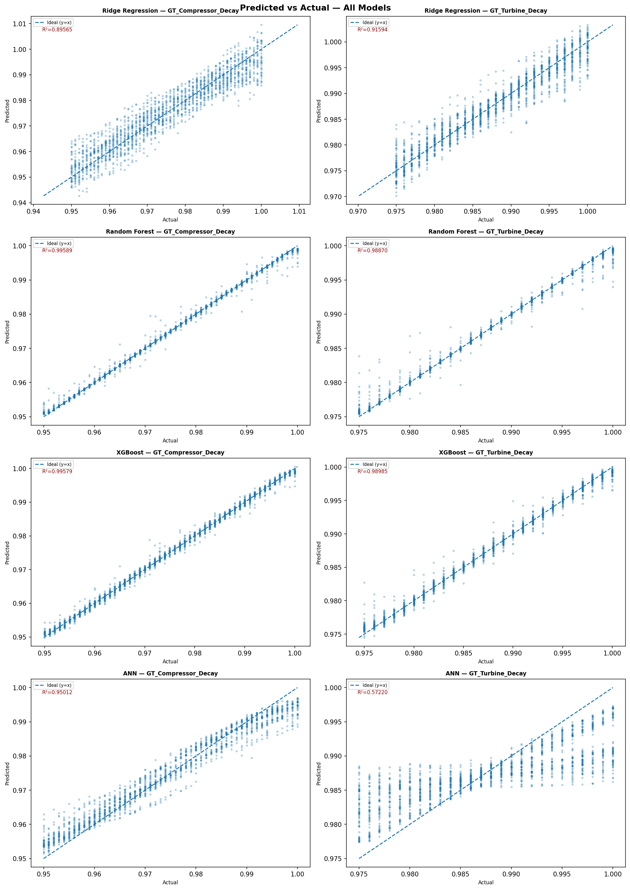

# Naval Propulsion Predictive Maintenance (Machine Learning)

End-to-end machine learning pipeline for **condition-based maintenance of naval gas turbine systems**, predicting component degradation before failure.

## 🚀 Key Result
**XGBoost achieves R² = 0.9928 (RMSE < 1e-3)** for simultaneous prediction of compressor and turbine decay — enabling high-precision early fault detection.

---

## 🧠 Problem
Gas turbine components degrade over time, reducing efficiency and increasing failure risk.  
This project predicts **Compressor Decay** and **Turbine Decay** using real-time sensor data, allowing **maintenance decisions before failure occurs**.

---

## ⚙️ Approach
- 16 sensor inputs from CODLAG propulsion system  
- Multi-output regression (2 targets)  
- Full ML pipeline: EDA → preprocessing → feature engineering → modeling → evaluation  

Models:
- Ridge Regression  
- Random Forest  
- **XGBoost (best performer)**  
- Artificial Neural Network (Keras)

---

## 📈 Performance Summary

| Model | RMSE | MAE | R² |
|------|------|-----|----|
| Ridge | 3.475e-3 | 2.726e-3 | 0.9058 |
| Random Forest | 8.75e-4 | **4.18e-4** | 0.9923 |
| **XGBoost** | **8.60e-4** | 6.02e-4 | **0.9928** |
| ANN | 4.120e-3 | 3.245e-3 | 0.7685 |

---

## ⚙️ Engineering Insight
- Compressor prediction error ≈ **1.9% of operating range**
- Turbine prediction error ≈ **3.07% of operating range**

👉 Both fall within acceptable thresholds for **real-world CBM early warning systems**
